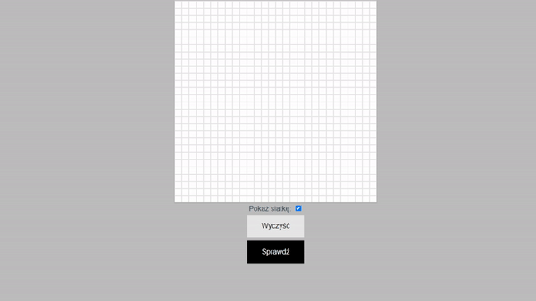

# whatdigit
```
$ git clone https://github.com/GrandeWaver/whatdigit.git
$ cd whatdigit
```

```
$ pip install -r requirements.txt
$ uvicorn main:app
```
:mega:</b>and be patient as the program takes some time to run</b>:clock1:
<br><br>


